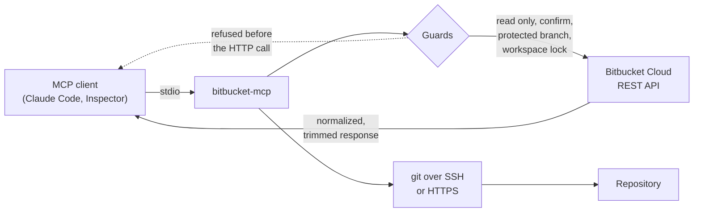

<div align="center">

# bitbucket-mcp

**MCP server for Bitbucket Cloud.** Pull requests, code review, branches, source,
pipelines, webhooks and variables, exposed as a controlled tool surface instead of
raw REST calls.

[](https://www.npmjs.com/package/@marcusyoda/bitbucket-mcp)
[](https://www.npmjs.com/package/@marcusyoda/bitbucket-mcp)
[](https://nodejs.org)
[](./LICENSE)
[](https://modelcontextprotocol.io)

</div>

---

## Why this exists

The official Atlassian MCP covers Jira and Confluence only. Bitbucket is left out, so
every repository operation falls back to hand written REST calls: verbose payloads,
no guard rails, and a token that can reach anything the scope allows.

This server closes that gap on three fronts:

- **Trimmed payloads.** Responses are normalized down to the fields you actually use,
  so a PR review costs a fraction of the context a raw REST response would.
- **Guard rails in the server, not in the prompt.** Protected branches, `confirm` on
  destructive actions and a read only mode are enforced before the HTTP call leaves.
- **One tool per intent.** 55 tools covering the review, branch, pipeline and webhook
  workflows, instead of one generic HTTP escape hatch.



---

## Install

The package is published on npm as
**[`@marcusyoda/bitbucket-mcp`](https://www.npmjs.com/package/@marcusyoda/bitbucket-mcp)**.

### Requirements

- Node >= 20
- A scoped Atlassian API token (see [Auth](#auth))
- An SSH key registered on Bitbucket, for the `git_*` tools over SSH. Optional if you
  use the HTTPS variants instead.

### Option 1: npx, nothing to install

The fastest path. Point your MCP client at the package and let npx resolve it:

```bash
npx -y @marcusyoda/bitbucket-mcp
```

### Option 2: global install

```bash
npm install -g @marcusyoda/bitbucket-mcp
# or: pnpm add -g @marcusyoda/bitbucket-mcp
bitbucket-mcp
```

### Option 3: from source

```bash
git clone https://github.com/marcusyoda/bitbucket-mcp.git
cd bitbucket-mcp
pnpm install
pnpm build          # dist/index.js
```

---

## Register in your MCP client

### Claude Code, via CLI

```bash
claude mcp add bitbucket \
  --env BITBUCKET_EMAIL=you@example.com \
  --env BITBUCKET_API_TOKEN=your-token \
  --env BITBUCKET_WORKSPACE=your-workspace \
  -- npx -y @marcusyoda/bitbucket-mcp
```

### Any client, via `.mcp.json`

```json
{
  "mcpServers": {
    "bitbucket": {
      "command": "npx",
      "args": ["-y", "@marcusyoda/bitbucket-mcp"],
      "env": {
        "BITBUCKET_EMAIL": "you@example.com",
        "BITBUCKET_API_TOKEN": "your-token",
        "BITBUCKET_WORKSPACE": "your-workspace",
        "BITBUCKET_DEFAULT_REPO": "your-repo-optional"
      }
    }
  }
}
```

Running from source instead? Swap the command for the built entry point:

```json
{ "command": "node", "args": ["/abs/path/to/bitbucket-mcp/dist/index.js"] }
```

Verify the connection by calling `get_current_user`: it round trips the token and
returns your Bitbucket identity.

---

## Auth

Auth is HTTP Basic with `email:api_token`. Create a scoped API token at
**id.atlassian.com > Manage account > Security > API tokens**.

Token scopes (granular picker, create only what you use):

| Capability | Scopes |
|------------|--------|
| Verify auth and identity | `read:account` |
| Read source, branches, repo | `read:repository:bitbucket` |
| Create branches and repos via API | `write:repository:bitbucket` |
| Review, approve, decline, merge PRs and comments | `read:pullrequest:bitbucket`, `write:pullrequest:bitbucket` |
| Pipelines (read, trigger, stop) | `read:pipeline:bitbucket`, `write:pipeline:bitbucket` |
| Webhooks | `read:webhook:bitbucket`, `write:webhook:bitbucket` |
| Optional: read pipeline and deployment variables | `admin:repository:bitbucket` |

The variable tools (`*_variable*`, `list_deployment_*`) need `admin:repository:bitbucket`.
Skipping that scope is fine: those tools return a 403 and everything else keeps working.

Rationale and the full permission decision record live in [PERMISSIONS.md](./PERMISSIONS.md).

### Environment

Copy `.env.example` to `.env` for local runs. Never commit it.

| Env var | Purpose |
|---------|---------|
| `BITBUCKET_EMAIL` | Atlassian account email, used by the REST API |
| `BITBUCKET_API_TOKEN` | Scoped API token |
| `BITBUCKET_WORKSPACE` | Workspace slug (required) |
| `BITBUCKET_USERNAME` | Bitbucket account username, not the email. Only for the HTTPS git tools |
| `BITBUCKET_DEFAULT_REPO` | Optional. Unset means `repo` is required on every call |
| `BITBUCKET_READ_ONLY` | `true` blocks every write and destructive tool |
| `BITBUCKET_PROTECTED_BRANCHES` | Comma separated, default `main,dev` |
| `BITBUCKET_LOCK_WORKSPACE` | `true` pins the session to `BITBUCKET_WORKSPACE` |

The package `.env` is loaded **only when `BITBUCKET_API_TOKEN` is absent** from the
environment. That way a launcher injecting per project credentials always wins, and a
stray `.env` from another workspace can never override the injected token.

---

## Safety model

- `BITBUCKET_READ_ONLY=true` blocks every write and destructive tool before it hits the API.
- Destructive tools (`merge`, `decline`, `delete_*`, `stop_pipeline`, `git_commit`,
  `git_push`, inline PR comments) require `confirm: true`.
- Creating a `secured` variable also requires `confirm: true`.
- Secured variable values are write only in the API and are never returned or logged.
- **Protected branches** (`BITBUCKET_PROTECTED_BRANCHES`, default `main,dev`) are hard
  blocked from direct mutation: `git_push`, `git_rebase` (when checked out), `delete_branch`
  and `create_branch` refuse to target them, even with `confirm`. Land changes there through
  a PR: `merge_pull_request` into a protected branch is allowed with `confirm: true`.
- **Workspace lock.** With `BITBUCKET_LOCK_WORKSPACE=true`, any call naming a different
  workspace is refused. Built for machines that serve several clients from one install.

---

## Tools

Every tool accepts optional `workspace` and `repo` to override the env defaults.

**Repo and meta:** `get_current_user`, `list_repositories`, `get_repository`,
`create_repository`

**Pull requests:** `list_pull_requests`, `get_pull_request`, `get_pull_request_diff`,
`get_pull_request_activity`, `create_pull_request`, `update_pull_request`,
`approve_pull_request`, `unapprove_pull_request`, `request_changes_pull_request`,
`decline_pull_request` *(confirm)*, `merge_pull_request` *(confirm)*, `list_pr_commits`,
`get_diff`

**Comments:** `list_pr_comments`, `add_pr_comment` *(inline needs confirm)*,
`reply_pr_comment`, `update_pr_comment`, `delete_pr_comment` *(confirm)*,
`resolve_comment`, `react_pr_comment` *(experimental)*

**Branches, source and git:** `list_branches`, `get_branch`, `create_branch`,
`delete_branch` *(confirm)*, `get_file_source`, `list_directory`, `clone_repo`,
`clone_repo_https`, `git_commit` *(confirm)*, `git_rebase`, `git_push` *(confirm)*,
`git_push_https` *(confirm)*. All push and branch tools refuse protected branches.

**Pipelines:** `list_pipelines`, `get_pipeline`, `get_pipeline_steps`,
`get_pipeline_step_log`, `trigger_pipeline`, `stop_pipeline` *(confirm)*

**Variables:** `list_repo_pipeline_variables`, `upsert_repo_pipeline_variable`,
`delete_repo_pipeline_variable` *(confirm)*, `list_workspace_variables`,
`list_deployment_environments`, `list_deployment_variables`,
`upsert_deployment_variable`, `delete_deployment_variable` *(confirm)*

**Webhooks:** `list_webhooks`, `get_webhook`, `create_webhook`, `update_webhook`,
`delete_webhook` *(confirm)*

### SSH or HTTPS for git

`clone_repo`, `git_commit`, `git_rebase` and `git_push` use your **SSH key**, not the
token. When SSH is not an option, `clone_repo_https` and `git_push_https` authenticate
with `username:token` and need `BITBUCKET_USERNAME`. The protected branch guard applies
to both transports.

---

## Known limitations

- **`react_pr_comment` is experimental.** Emoji reactions on PR comments are documented
  for Bitbucket Data Center, not Cloud. The tool targets a best effort endpoint and may
  return an error if your workspace does not support it.
- **`resolve_comment`** depends on comment thread resolution being available for the repo.
- There is no endpoint listing which variables a custom pipeline expects. That information
  comes from `bitbucket-pipelines.yml`, read it with `get_file_source`.
- Stored variable values require admin scope to read back.

---

## Develop

```bash
pnpm install
pnpm dev         # tsx watch
pnpm typecheck
pnpm build       # tsup, ESM
pnpm inspect     # build and open the MCP Inspector
```

Project rules and conventions live in [CLAUDE.md](./CLAUDE.md). Contributions follow the
issue first workflow: every commit links an issue in its header, as `type(scope): subject [#N]`.

---

## License

MIT. See [LICENSE](./LICENSE).
